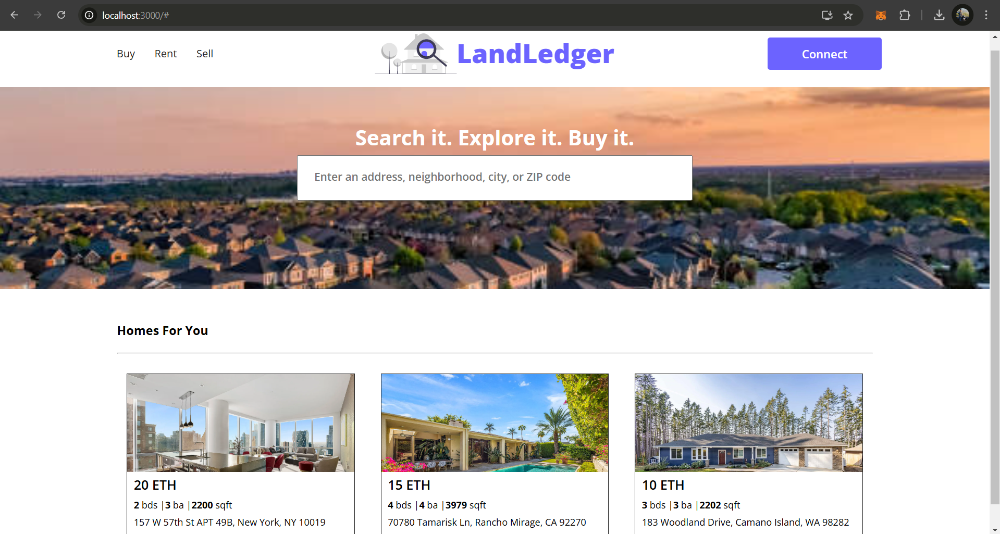

# LandLedger

LandLedger is a decentralized real estate platform leveraging blockchain technology to revolutionize the buying, selling, and management of real estate properties. By ensuring transparency, security, and efficiency, LandLedger aims to reshape the real estate ecosystem.

## Technologies Used
- **Frontend**: React.js, HTML, CSS
- **Backend**: Node.js, Express
- **Blockchain**: Ethereum, Smart Contracts (Solidity)
- **Database**: IPFS for decentralized data storage

## Requirements For Initial Setup
- Install [NodeJS](https://nodejs.org/en/)

## Setting Up
### 1. Clone/Download the Repository

### 2. Install Dependencies:
`$ npm install`

### 3. Run tests
`$ npx hardhat test`

### 4. Start Hardhat node
`$ npx hardhat node`

### 5. Run deployment script
In a separate terminal execute:
`$ npx hardhat run ./scripts/deploy.js --network localhost`

### 7. Start frontend
`$ npm run start`

### Demo
## Home Page

## Connection

## Transaction

## Transaction process

## Approve and sell by Seller

## Inspect
